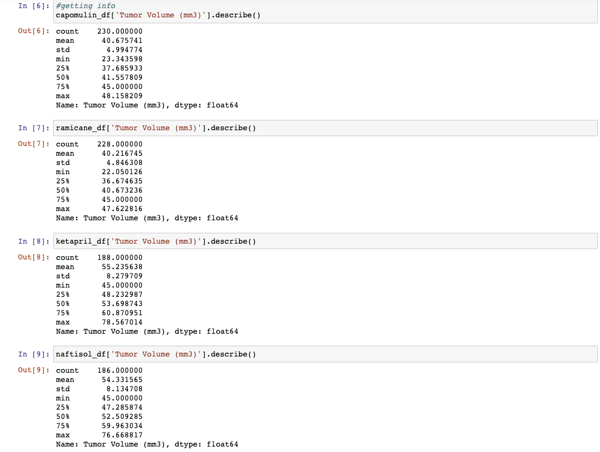

## Background

While your data companions rushed off to jobs in finance and government, you remained adamant that science was the way for you. Staying true to your mission, you've joined Pymaceuticals Inc., a burgeoning pharmaceutical company based out of San Diego. Pymaceuticals specializes in anti-cancer pharmaceuticals. In its most recent efforts, it began screening for potential treatments for squamous cell carcinoma (SCC), a commonly occurring form of skin cancer.

As a senior data analyst at the company, you've been given access to the complete data from their most recent animal study. In this study, 249 mice identified with SCC tumor growth were treated through a variety of drug regimens. Over the course of 45 days, tumor development was observed and measured. The purpose of this study was to compare the performance of Pymaceuticals' drug of interest, Capomulin, versus the other treatment regimens. You have been tasked by the executive team to generate all of the tables and figures needed for the technical report of the study. The executive team also has asked for a top-level summary of the study results.

## Analyzing the Data

* Summary statistics table consisting of the mean, median, variance, standard deviation, and SEM of the tumor volume for each drug regimen.

* Bar plot using both Pandas's and Matplotlib's that shows  the number of total mice for each treatment regimen throughout the course of the study.

* Pie plot using both Pandas's and Matplotlib's that shows the distribution of female or male mice in the study.

* Final tumor volume of each mouse across four of the most promising treatment regimens: Capomulin, Ramicane, Infubinol, and Ceftamin. Quartiles and IQR and quantitatively determine if there are any potential outliers across all four treatment regimens.

* Box and whisker plot of the final tumor volume for all four treatment regimens

* Mouse that was treated with Capomulin and generate a line plot of tumor volume vs. time point for that mouse.

* Scatter plot of mouse weight versus average tumor volume for the Capomulin treatment regimen.

* The correlation coefficient and linear regression model between mouse weight and average tumor volume for the Capomulin treatment. Plot the linear regression model on top of the previous scatter plot.

